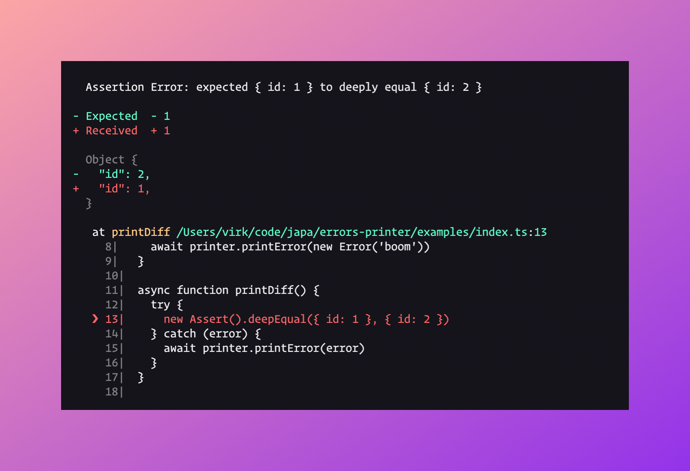
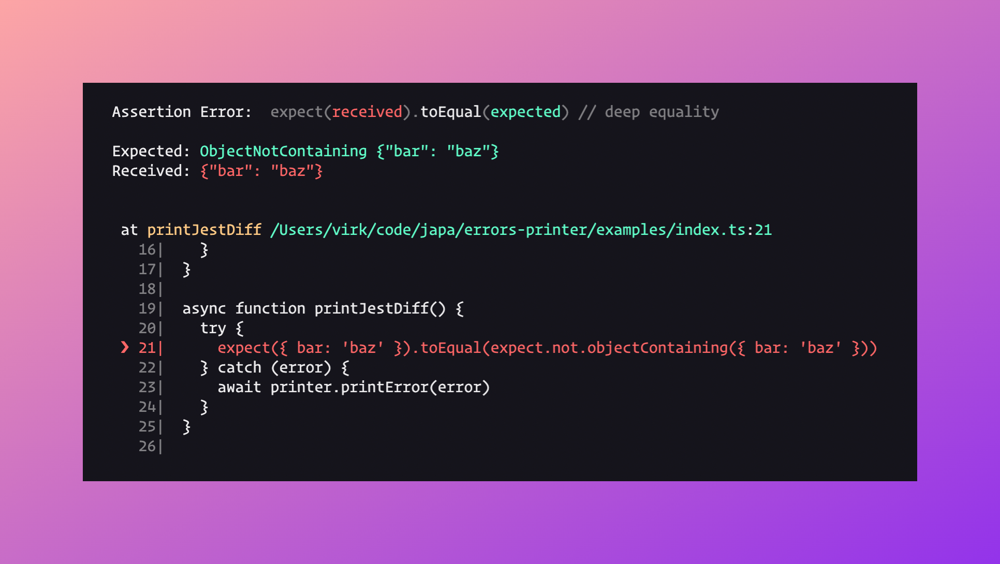
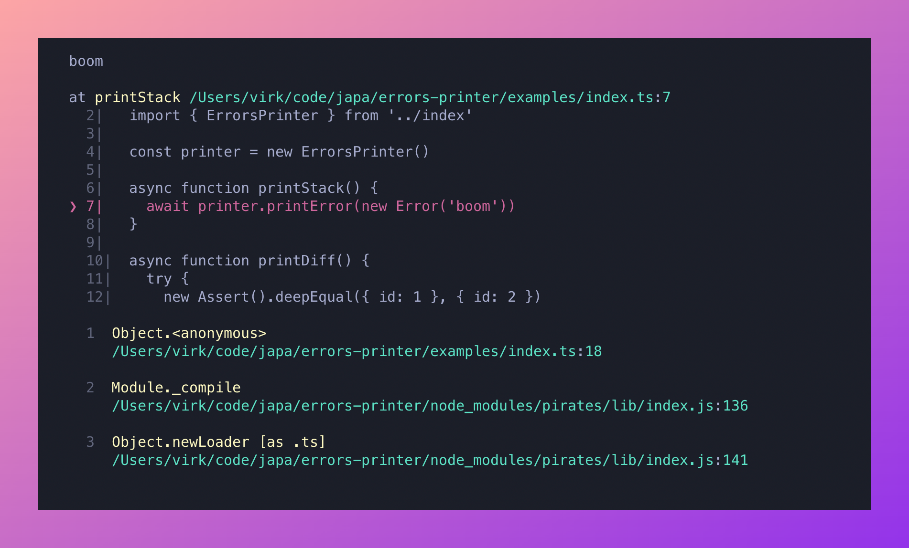

# @japa/errors-printer
> Print errors produced by the Japa tests runner

[![github-actions-image]][github-actions-url] [![npm-image]][npm-url] [![license-image]][license-url] [![typescript-image]][typescript-url]

## Installation
Install the package from the npm registry as follows:

```sh
npm i @japa/errors-printer

# yarn
yarn add @japa/errors-printer
```

## Usage
You can print errors produced by japa test runner as follows.

```ts
import { ErrorsPrinter } from '@japa/errors-printer'

const printer = new ErrorsPrinter()
const error = new Error('boom')

await printer.printError(error)
```

Most of the times, you will find yourself printing errors using the Japa test summary. Here is how you can go about doing it.

```ts
import { ErrorsPrinter } from '@japa/errors-printer'

const printer = new ErrorsPrinter()

// assuming you have the runner instance
const summary = runner.getSummary()
const errorsList = []

summary.failureTree.forEach((suite) => {
  suite.errors.forEach((error) => {
    errorsList.push({ title: suite.name, ...error })
  })

  suite.children.forEach((groupOrTest) => {
    if (groupOrTest.type === 'test') {
      groupOrTest.errors.forEach((error) => {
        errorsList.push({ title: groupOrTest.title, ...error })
      })
      return
    }

    groupOrTest.errors.forEach((error) => {
      errorsList.push({ title: groupOrTest.name, ...error })
    })
    groupOrTest.children.forEach((test) => {
      test.errors.forEach((error) => {
        errorsList.push({ title: test.title, ...error })
      })
    })
  })
})

await printer.printErrors(errorsList)
```

## API
Following are the available methods.

### printError()
Accepts error as the only argument. If the error is an assertion error, then the diff will be displayed. Otherwise, the error stack is printed.

**Assertion diff**

```ts
import { Assert } from '@japa/assert'
import { ErrorsPrinter } from '@japa/errors-printer'

const printer = new ErrorsPrinter()

try {
  new Assert().deepEqual({ id: 1 }, { id: 2 })
} catch (error) {
  await printer.printError(error)
}
```



**Jest error**

```ts
import expect from 'expect'
import { ErrorsPrinter } from '@japa/errors-printer'

const printer = new ErrorsPrinter()

try {
  expect({ bar: 'baz' }).toEqual(expect.not.objectContaining({ bar: 'baz' }))
} catch (error) {
  await printer.printError(error)
}
```



**Error stack**

```ts
import { ErrorsPrinter } from '@japa/errors-printer'

const printer = new ErrorsPrinter()
await printer.printError(new Error('boom'))
```



### printErrors
Print an array of errors produced by the Japa test runner summary. The method accepts an array of errors in the following format.

```ts
type Error = {
  title: string,
  phase: string,
  error: Error
}
```

```ts
await printer.printErrors([
  {
    phase: 'test',
    title: '2 + 2 = 4'
    error: new Error('test failed')
  },
  {
    phase: 'teardown',
    title: '2 + 2 = 4'
    error: new Error('teardown failed')
  }
])
```

[github-actions-image]: https://img.shields.io/github/actions/workflow/status/japa/errors-printer/checks.yml?style=for-the-badge

[github-actions-url]: https://github.com/japa/errors-printer/actions/workflows/checks.yml "github-actions"

[npm-image]: https://img.shields.io/npm/v/@japa/errors-printer.svg?style=for-the-badge&logo=npm
[npm-url]: https://npmjs.org/package/@japa/errors-printer "npm"

[license-image]: https://img.shields.io/npm/l/@japa/errors-printer?color=blueviolet&style=for-the-badge
[license-url]: LICENSE.md "license"

[typescript-image]: https://img.shields.io/badge/Typescript-294E80.svg?style=for-the-badge&logo=typescript
[typescript-url]:  "typescript"
